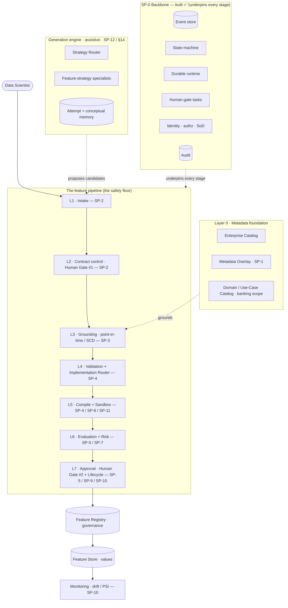
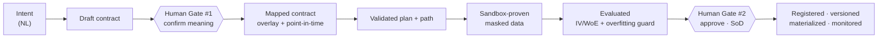
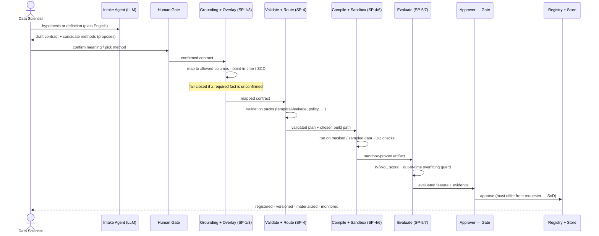
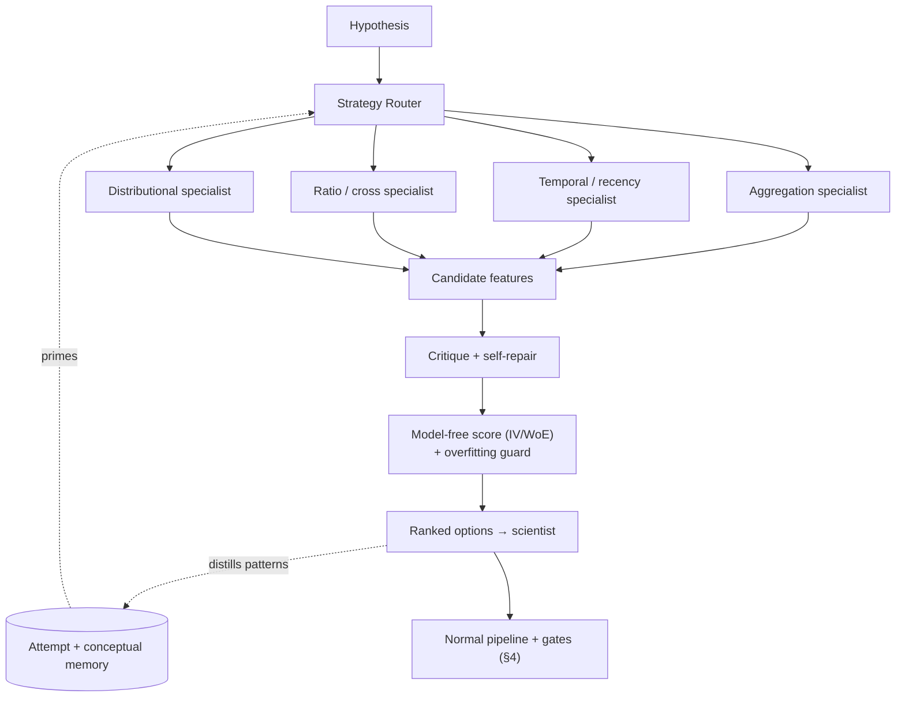
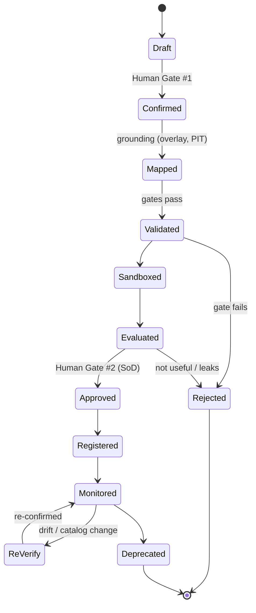

# FeatureGen — Reference Architecture & End-to-End Flow

**Status:** Reference (the front-door overview). For full detail see the [design spec](./2026-06-27-feature-engineering-platform-design.md); for the build breakdown see the [roadmap](./2026-06-27-feature-engineering-platform-roadmap.md).
**Audience:** anyone who wants to understand *what the platform is, who the agents are, and how a feature flows from a sentence to production* — with diagrams.

---

## 1. What it is, in one screen

A **contract-driven, banking-grade feature engineering platform**. A data scientist describes a feature in plain English; the platform turns it into a **point-in-time-correct, policy-compliant, reviewed, versioned, monitored** production feature — safely.

> **The one rule (the authority model):**
> **The LLM/agents *suggest and structure*. The platform *validates and enforces*. The human *confirms business meaning*. The registry *governs the production lifecycle*.**
> No actor does another's job. It is explicitly **not** `free text → LLM → SQL → feature store`.

It is **banking-only by design**: it can build *any banking feature*, but rejects out-of-banking requests (a closed boundary with an open, growing set of banking use-cases).

---

## 2. The big picture

Seven layers sit on top of a reliable **backbone** (SP-0, already built). Layer 0 (catalog + overlay + domain catalog) feeds grounding; an assistive **generation engine** proposes candidates into intake; the **registry** governs and the **store** serves.

---

## 3. The agentic model — who proposes, who decides

The platform is "agentic" in a **bounded** way: LLM agents do the creative, language, and search work, but **every output is a proposal** that deterministic checks validate and a human confirms. Three kinds of actor:

### 3a. The agents (LLM — *propose only*)
| Agent | Proposes | Bounded by | Validated by → confirmed by |
|---|---|---|---|
| **Intake normalizer** (SP-2) | a *draft contract* from NL intent | the two intake modes; domain catalog | gates → **Human Gate #1** |
| **Ambiguity scorer + doubt router** (SP-2) | clarifying questions / candidate calculation methods | ambiguity score | the scientist at Gate #1 |
| **Grounding assistant** (SP-3) | a mapping of the concept to *real, allowed* columns | overlay facts; policy tags | deterministic mapping checks → mapping review |
| **Generation Router + feature-strategy specialists** (SP-12 / §14.8) | domain-salient candidate features (aggregation / temporal / ratio / distributional) | the hypothesis + domain catalog templates | scoring → the scientist (ranked options) |
| **Symbolic / scorecard synthesizer** (§14.6) | interpretable parametric features / monotonic scorecards | catalog `symbolic_synthesis` flag | fit-on-PIT-sample + gates → human |
| **Few-shot proposer** (§14.7) | candidate features when labels are scarce (cold start) | label threshold | staged stamp (stays Design/Data-checked) |
| **LLM candidate-SQL drafter** (SP-6, Path 2) | candidate SQL | SQL validation gate | sandbox + gates |
| **Critique + self-repair** (SP-8, §5.6) | fixes to its own candidates (5 modes) | non-gate, advisory | the real gates still run |
| **Conceptual-memory distiller** (§14.9) | "what patterns work here" rules | suggestion only | owner/Compliance before catalog promotion |

### 3b. The humans (*confirm meaning · approve*)
- **Data scientist** — submits intent; **confirms business meaning at Human Gate #1** (incl. picking the calculation method from scored options).
- **Data owner / Compliance** — **confirm overlay facts** (data facts vs policy facts; SP-1) under strict authority.
- **Approver (≠ requester)** — **Human Gate #2**, four-eyes / segregation of duties.

### 3c. The deterministic enforcers (*no LLM — they decide pass/fail*)
Validation packs (schema, type, entity, grain, join, **temporal-leakage / point-in-time**, policy, fairness), the **sandbox** (runs on masked/sampled data), **model-free scoring** (Information Value / WoE) + the **search-overfitting guard**, the **Implementation Router** (picks the safest build path), and the whole **SP-0 backbone**. These are where "PASSED/FAILED" is actually decided — not the LLM.

---

## 4. The complete end-to-end flow

### 4a. The pipeline at a glance (with the two human gates)

### 4b. End-to-end sequence (who calls whom)

### 4c. The same flow in plain English (banking example)
Hypothesis: *"customers with irregular salary credits are more likely to churn."*

1. **Submit** → the scientist types the hypothesis. *(Backbone logs it and starts tracking — survives restarts.)*
2. **Intake agent** turns it into a **draft contract** and proposes several ways to measure "salary irregularity" (stddev of inter-credit gaps, coefficient of variation, missed-payday count). *Proposes — not decides.*
3. **Human Gate #1** → the scientist **confirms** the churn definition, the lookback, and **picks the method**.
4. **Grounding** maps "salary credits" to real, *allowed* columns and pins the **availability time** (`posted_at`) so the feature can't peek into the future. If a needed fact isn't confirmed in the **overlay**, it **fails closed** and opens a confirmation task for the **data owner / Compliance**.
5. **Validation + Router** runs deterministic checks (the **temporal-leakage gate** is the critical one here) and picks the **safest build path** (DSL compiler first).
6. **Compile + Sandbox** builds it and runs it on **masked/sampled** data with data-quality checks.
7. **Evaluate** scores it with **Information Value / WoE** (no trained model needed) and a **second out-of-time check** to reject lucky winners. The feature gets an honest **stamp**: Design- → Data- → *Usefulness-checked*.
8. **Human Gate #2** → a **different person** (four-eyes) approves, seeing the evidence and an explanation.
9. **Register + materialize + monitor** → it becomes an **immutable, versioned** feature, computed on a schedule, watched for drift.

Throughout, the **backbone** makes this reliable across the days it may take (waiting on people, surviving restarts, retrying glitches safely, chasing slow approvers) — see §6.

### 4d. The assistive generation engine (when intent is a hypothesis)

The Router picks which specialists to run (by data shape + which has earned the most IV gain), specialists propose, critique repairs, scoring ranks — and everything still enters the **normal pipeline and gates**. It never bypasses §4.

---

## 5. Lifecycle & state

Every request/feature advances through a **state machine** (SP-0). Simplified feature lifecycle:

---

## 6. The backbone (SP-0) — why it's reliable

Everything above plugs into SP-0 (built, 478 tests green). It provides:
- **A permanent, append-only event store** + **projections** (read models) — every action is recorded; nothing is lost.
- **Declarative state machines** — each request/feature/run always has a known state.
- **A durable runtime** — the multi-day, human-dependent process keeps moving across restarts: transactional outbox, idempotent handlers, **durable timers** (SLA → reminder → escalation → auto-park), bounded retries.
- **Human-gate tasks** — the mechanism behind both gates (eligibility, quorum, SoD).
- **Identity · authz · structural SoD** — who may do what; the requester can't approve their own feature.
- **Governance & privacy** — provenance/reproducibility, crypto-shred, audit.

This is what makes "submit and walk away" actually work.

---

## 7. How the architecture maps to the build

| Layer / capability | Sub-project | Status |
|---|---|---|
| Backbone (event store, state machine, durable runtime, gates, identity/SoD, governance, privacy) | **SP-0** | ✅ **Built** (Python + Postgres, 478 tests) |
| Layer 0 · Metadata Overlay (fact store, merged-view, confirmation, profiler, freshness) | **SP-1** | 📋 Spec + implementation plan ready |
| L1–2 · Intake + Clarification + Human Gate #1 | **SP-2** | 🔭 Designed |
| L3 · Grounding (point-in-time / SCD) | **SP-3** | 🔭 Designed |
| L4–5 · Validation core + DSL compiler + Sandbox (Path 1) | **SP-4** | 🔭 Designed |
| L6–7 · Eval (model-free) + staged stamp + Gate #2 + Registry + Store | **SP-5** | 🔭 Designed |
| Path 2 · LLM candidate SQL + repair + SQL gate | **SP-6** | 🔭 Designed |
| Full validation + semantic leakage + fairness + overfitting guard | **SP-7** | 🔭 Designed |
| Critique Service (5 modes) | **SP-8** | 🔭 Designed |
| Hypothesis-driven Generation engine (§14: router, specialists, memory, symbolic, few-shot) | **SP-12** | 🔭 Designed |
| Governance (MRM, explainability artifact, SoD, reproducibility) | **SP-9** | 🔭 Designed |
| Lifecycle & Monitoring (drift/PSI, change-impact, harvest loop) | **SP-10** | 🔭 Designed |
| Path 3 (human SQL) + RBAC / exposure enforcement | **SP-11** | 🔭 Designed |

Build order (roadmap): **Phase A** SP-0 ✅ / SP-1 → **Phase B** vertical slice SP-2…SP-5 (the end-to-end "walking skeleton") → **Phase C** coverage SP-6/7/8/12 → **Phase D** hardening SP-9/10/11.

---

## 8. The safety model (why it can be trusted in a bank)

- **Two human gates + segregation of duties** — meaning is confirmed (Gate #1) and approval is four-eyes (Gate #2); no one approves their own work.
- **Fail-closed everywhere** — a missing/unconfirmed fact blocks; a feature is usable only when fully verified.
- **Point-in-time correctness** — availability time (`posted_at`) is enforced so features can't see the future; *temporal leakage is a hard, deterministic gate*.
- **Leakage is two problems** — temporal (hard gate) and semantic/proxy (evaluation + human); "PASSED" never means "leakage-free."
- **Model-free scoring + overfitting guard** — features are ranked without a trained model, with an out-of-time re-check to reject lucky winners.
- **Honest staged stamp** — Design- → Data- → Usefulness-checked; production needs *Usefulness-checked*.
- **Full provenance & reproducibility** — immutable versions, frozen fit-data/seeds, registered explainability — a regulator can reproduce any feature.
- **Banking boundary** — out-of-banking requests are rejected (Domain Catalog).

---

## 9. Where to read more
- Full design detail → [`2026-06-27-feature-engineering-platform-design.md`](./2026-06-27-feature-engineering-platform-design.md) (§1 authority model, §6 overlay, §14 generation, §15 domain catalog).
- Build decomposition → [`2026-06-27-feature-engineering-platform-roadmap.md`](./2026-06-27-feature-engineering-platform-roadmap.md).
- Backbone → [`2026-06-27-sp0-foundations-design.md`](./2026-06-27-sp0-foundations-design.md).
- Metadata Overlay → [`2026-06-29-sp1-metadata-overlay-design.md`](./2026-06-29-sp1-metadata-overlay-design.md).
- Banking scope → [`2026-06-29-banking-domain-catalog.md`](./2026-06-29-banking-domain-catalog.md).
