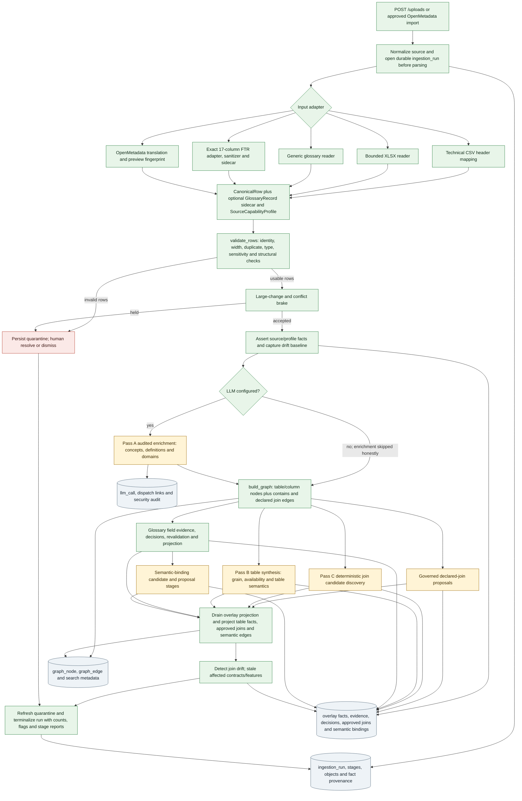
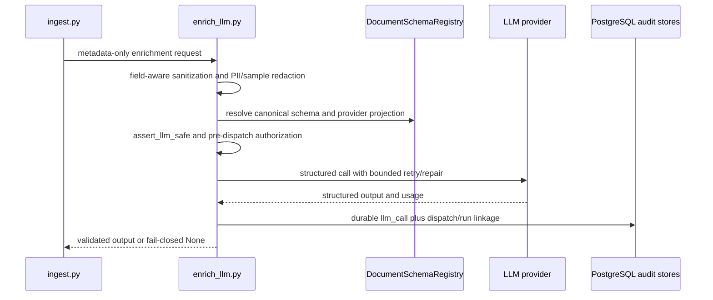
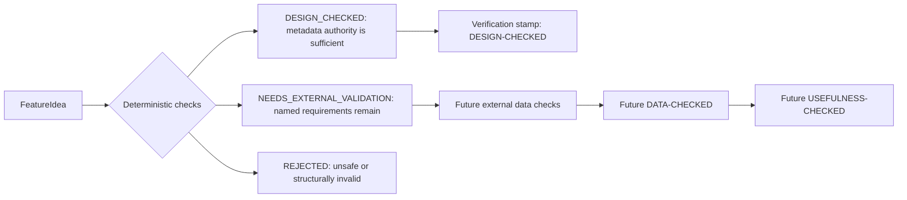
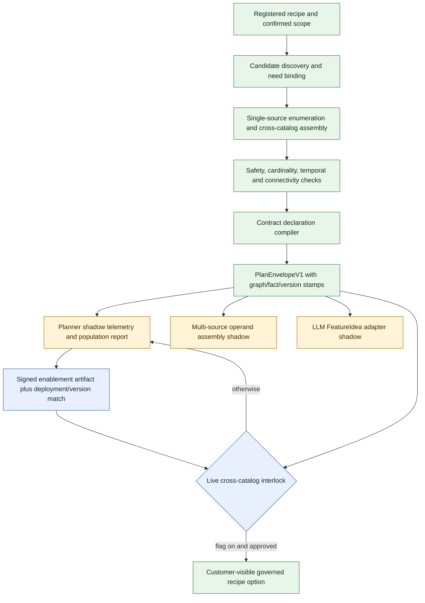
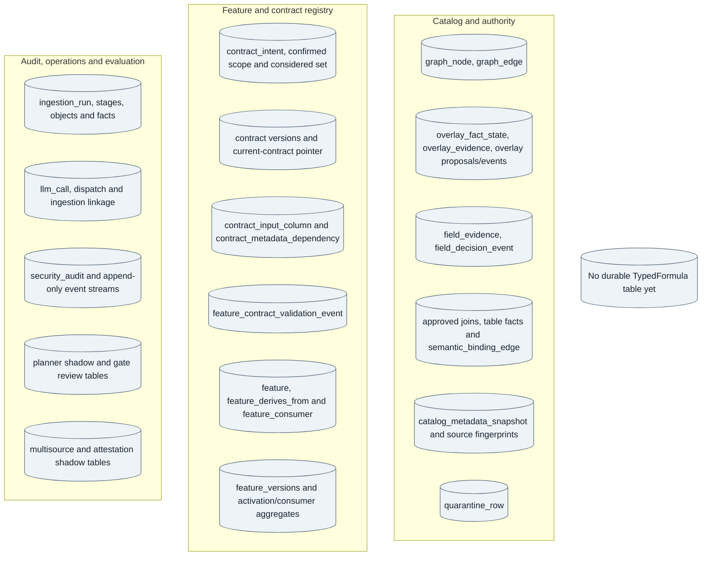
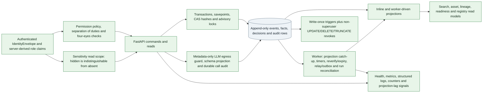

# Feature Generation: End-to-End Architecture

Date: 2026-07-23

Interactive version: [Feature Generation Workflow](./feature-generation-workflow.html)

## Scope And Baseline

This document maps the feature-generation workflow from catalog ingestion through governed feature
registration, formula authoring, and external materialization. It is grounded in:

- Implemented baseline: `origin/main` at `3668b93`.
- In-flight formula critic: `merge/b-slice-to-main` at `1c01bfc`.
- Current frontend worktree: includes an uncommitted asset-detail prototype; it is marked as WIP and
  is not treated as a completed backend integration.

Status used in the diagrams:

- **Implemented**: present on `origin/main` and reachable through code or a documented CLI.
- **Shadow**: executes only for telemetry/evaluation and cannot affect customer-visible output.
- **In flight**: implemented on an integration branch but not on `origin/main`.
- **Planned**: designed but not yet implemented or wired.
- **External**: owned by the customer's execution platform, not this metadata platform.

## 1. End-To-End System

```mermaid
flowchart LR
    classDef implemented fill:#e8f5e9,stroke:#247a3b,color:#102a18
    classDef shadow fill:#fff4d6,stroke:#9a6700,color:#3b2a00
    classDef inflight fill:#e8f0fe,stroke:#315ea8,color:#13233f
    classDef planned fill:#f2f2f2,stroke:#777,color:#333,stroke-dasharray: 5 4
    classDef external fill:#fbe9e7,stroke:#b33a2b,color:#3b1511
    classDef store fill:#eef3f7,stroke:#526779,color:#17232d

    subgraph Actors["Users and systems"]
        DO["Data owner / catalog curator"]:::implemented
        FE["Feature engineer"]:::implemented
        PA["Platform administrator / confirmer"]:::implemented
        OM["OpenMetadata"]:::external
        XP["External data and feature platform"]:::external
    end

    subgraph UI["React application"]
        INGEST_UI["Ingest and integrations"]:::implemented
        CATALOG_UI["Search, lineage, governance, registry"]:::implemented
        ASSET_UI["Asset-detail edit screen"]:::inflight
        WORKBENCH["Feature-generation workbench"]:::implemented
    end

    subgraph API["FastAPI boundary"]
        INGEST_API["Uploads and connector APIs"]:::implemented
        READ_API["Search, asset, lineage and governance APIs"]:::implemented
        ASSIST_API["Feature assist and considered-set APIs"]:::implemented
        CONTRACT_API["Draft, confirm and feature registry APIs"]:::implemented
        FORMULA_API["Formula-authoring API"]:::planned
    end

    subgraph Catalog["Catalog ingestion and authority"]
        PARSE["CSV, Excel, FTR glossary and OpenMetadata adapters"]:::implemented
        VALIDATE["Profile-aware validation, quarantine and large-change brake"]:::implemented
        ENRICH["Audited LLM enrichment: concept, definition, domain, table synthesis"]:::implemented
        GRAPH["Catalog graph and search projection"]:::implemented
        AUTHORITY["Evidence, decisions, confirmed facts, approved joins and semantic bindings"]:::implemented
        INGEST_SHADOW["Pass C and semantic-binding candidate paths"]:::shadow
    end

    subgraph Generation["Feature proposal and contract generation"]
        INTENT["Intent recognition, confirmed scope and deterministic ranking"]:::implemented
        SNAPSHOT["Repeatable metadata snapshot and feature context"]:::implemented
        PROPOSE["LLM feature proposals and bounded independent critic loop"]:::implemented
        GAUNTLET["Deterministic grounding, leakage, freshness, PIT, type, additivity and join checks"]:::implemented
        RECIPE["Recipe lens and governed deterministic planner"]:::implemented
        PLAN_SHADOW["Planner, multi-source and LLM cross-catalog shadow harnesses"]:::shadow
        CHOICE["Persisted considered set and human Gate 1 choice"]:::implemented
        CONTRACT["Server-rebound draft, MCV recheck, drift recheck and confirm"]:::implemented
    end

    subgraph Formula["TypedFormula authoring"]
        AUTHOR["Bounded sequential-turn LLM author and seven read-only tools"]:::implemented
        FORMULA_CHECKS["Strict parse, structural validation, capability and C1 output authority"]:::implemented
        CRITIC["Independent formula critic"]:::inflight
        RESULT["Multi-axis disposition and canonical content hash"]:::implemented
        ORCHESTRATOR["Durable trace, end-to-end orchestrator, gold gate and API wiring"]:::planned
    end

    subgraph Materialization["Materialization and verification"]
        FREEZE["Approved immutable formula version"]:::planned
        COMPILE["Execution-platform compiler and submission contract"]:::planned
        EXECUTE["Execute against customer data"]:::external
        ATTEST["Signed data-validation and usefulness attestations"]:::planned
    end

    PG[("PostgreSQL: graph, authority, audit, contracts, registry and shadow telemetry")]:::store
    LLM["Configured LLM provider through audited structured-call adapter"]:::external

    DO --> INGEST_UI --> INGEST_API
    OM --> INGEST_API
    INGEST_API --> PARSE --> VALIDATE --> ENRICH --> GRAPH --> AUTHORITY
    VALIDATE --> PG
    ENRICH --> LLM
    ENRICH --> PG
    GRAPH --> PG
    AUTHORITY --> PG
    GRAPH --> INGEST_SHADOW --> PG

    DO --> CATALOG_UI --> READ_API
    PA --> CATALOG_UI
    READ_API --> PG
    CATALOG_UI -. "detail prototype" .-> ASSET_UI

    FE --> WORKBENCH --> ASSIST_API --> INTENT --> SNAPSHOT
    SNAPSHOT --> PROPOSE --> GAUNTLET --> CHOICE
    SNAPSHOT --> RECIPE --> CHOICE
    PROPOSE --> LLM
    RECIPE --> PLAN_SHADOW --> PG
    CHOICE --> CONTRACT_API --> CONTRACT --> PG
    CONTRACT --> LLM

    PG --> SNAPSHOT
    PG --> GAUNTLET
    PG --> RECIPE
    PA --> CONTRACT_API

    CONTRACT -. "planned authoring handoff" .-> FORMULA_API
    FORMULA_API -.-> AUTHOR --> FORMULA_CHECKS --> CRITIC --> RESULT --> ORCHESTRATOR
    AUTHOR --> LLM
    FORMULA_CHECKS --> PG

    ORCHESTRATOR -.-> FREEZE -.-> COMPILE -.-> XP
    XP --> EXECUTE --> ATTEST -.-> PG
```



The catalog graph is the metadata substrate, not the final feature definition. A registered governed
contract currently reaches `DESIGN-CHECKED`; it does not imply that a formula has been compiled or
executed against customer data.

## 2. Catalog Ingestion And Graph Construction



### Ingestion safety boundary

Every LLM enrichment call goes through the same audited adapter:



Enrichment is advisory and fail-contained. Provider, schema or evidence-write failures can make a
stage partial, but they must not roll back successfully asserted source facts or the graph.

## 3. Feature Recommendation And Contract Governance

```mermaid
sequenceDiagram
    actor User as Feature engineer
    participant UI as WorkbenchScreen
    participant API as contract.py / assist.py
    participant Scope as recognition + scope + ranking
    participant Snap as metadata snapshot / column views
    participant LLM as audited LLM calls
    participant Guard as deterministic gauntlet
    participant Planner as recipe planner / compiler
    participant DB as PostgreSQL
    participant Confirm as contract.govern

    User->>UI: Hypothesis, objective, source/entity and target
    UI->>API: POST /contract/considered-set
    opt Scoped-applicability flag
        API->>Scope: recognize use case and proposed dimensions
        Scope-->>User: human confirms or broadens scope
        Scope->>Scope: applicability and deterministic ranking
    end
    API->>Snap: build repeatable catalog metadata snapshot
    Snap->>DB: read-scoped graph and verified operational facts

    par Free-form and strategy-lens proposals
        Snap->>LLM: bounded feature proposal turns
        LLM-->>Guard: FeatureIdea candidates
        Guard->>DB: ground exact source-qualified operands
        Guard->>Guard: leakage, freshness, PIT, type, additivity, unit/currency and connectivity
        Guard-->>API: DESIGN_CHECKED / NEEDS_EXTERNAL_VALIDATION / REJECTED
    and Recipe lens
        API->>Planner: enumerate typed recipe bindings
        Planner->>DB: governed grain, join and semantic authority
        Planner->>Planner: plan, compile declarations and create plan envelope
        Planner-->>API: resolved options and reason-coded rejections
    end

    API->>DB: persist intent, considered-set snapshot and metadata snapshot binding
    API-->>UI: alternatives, ranking, rejections and intent_id
    User->>UI: Select one candidate
    UI->>API: POST /contract/draft
    API->>DB: reconstruct chosen option server-side
    API->>Planner: recheck governed-plan freshness when envelope exists
    API->>LLM: author narrative definition from metadata only
    API-->>UI: ContractDraft
    User->>UI: Confirm govern
    UI->>API: POST /contract/confirm
    API->>DB: reconstruct choice; ignore client authority claims
    API->>Confirm: source locks, feature lock and deterministic MCV re-run
    Confirm->>Planner: rebuild governed plan and verify stable identities
    Confirm->>DB: insert immutable contract version, inputs, dependencies and validation event
    Confirm->>DB: create/reuse feature, derives-from rows and advance current-contract pointer
    Confirm-->>UI: contract_id, feature_id and version
```

### Proposal result axes

The proposal's contract validation state is separate from the feature verification stamp:



`NEEDS_EXTERNAL_VALIDATION` is not a failure. It is the honest state when this platform lacks data
access and therefore cannot prove numeric type, uniqueness, temporal population, lag bounds or other
data-dependent requirements.

## 4. Governed Cross-Catalog Planning



The live interlock is stricter than an environment flag. It also checks the signed gate artifact,
deployment ID and approved version set. A stale or missing plan envelope is regenerated; it is never
replaced with a permissive cross-catalog path.

## 5. TypedFormula Authoring Status

TypedFormula authoring is a separate step from ingestion and contract generation. It converts an
approved feature intent into a closed, content-addressed computation contract. It does not execute
the formula.

```mermaid
flowchart LR
    classDef implemented fill:#e8f5e9,stroke:#247a3b,color:#102a18
    classDef inflight fill:#e8f0fe,stroke:#315ea8,color:#13233f
    classDef planned fill:#f2f2f2,stroke:#777,color:#333,stroke-dasharray: 5 4

    H["Governed feature or contract"]:::implemented
    HANDOFF["Feature-to-AuthoringIntent adapter"]:::planned
    AI["AuthoringIntent"]:::implemented
    A["Sequential-turn author"]:::implemented
    T["Seven read-only, read-scoped metadata tools"]:::implemented
    AUD["Audited structured-call seam"]:::implemented
    P["Strict JSON parse and semantic validation"]:::implemented
    CAP["Versioned capability classifier"]:::implemented
    OUT["C1 operational output authority and additivity proofs"]:::implemented
    CR["Independent critic with closed finding codes"]:::inflight
    FOLD["Multi-axis disposition"]:::implemented
    HASH["RFC 8785 plus NFC canonical hash"]:::implemented
    TRACE["Manifest-first trace and replay model"]:::planned
    GOLD["Real-provider gold enablement gate"]:::planned
    API["Formula-authoring API and UI"]:::planned
    STORE["Approved immutable formula version"]:::planned

    H -.-> HANDOFF -.-> AI --> A
    A <--> T
    A --> AUD --> P --> CAP --> OUT --> CR --> FOLD
    FOLD --> HASH
    FOLD -.-> TRACE
    HASH -.-> GOLD
    GOLD -.-> API -.-> STORE
```



Current implemented outputs are library objects and audited `llm_call` rows. There is no completed
`run_authoring` orchestration, authoring trace migration, HTTP endpoint or durable formula-version
artifact on `origin/main`.

## 6. Materialization And External Execution Boundary

```mermaid
flowchart LR
    classDef current fill:#e8f5e9,stroke:#247a3b,color:#102a18
    classDef planned fill:#f2f2f2,stroke:#777,color:#333,stroke-dasharray: 5 4
    classDef external fill:#fbe9e7,stroke:#b33a2b,color:#3b1511

    C["Governed feature contract: DESIGN-CHECKED"]:::current
    TF["Approved TypedFormula version"]:::planned
    IR["Platform-neutral logical/physical IR"]:::planned
    JOB["Signed external submission with pinned inputs, grain, window and policy versions"]:::planned
    EXT["Customer data platform compiler and runtime"]:::external
    DATA["Customer data"]:::external
    OBS["Execution observations: schema, uniqueness, nulls, ranges, freshness and row counts"]:::external
    ATT["Signed attestation ingestion and replay verification"]:::planned
    DC["Feature version promoted to DATA-CHECKED"]:::planned
    USE["Backtest / model evaluation and USEFULNESS-CHECKED"]:::planned

    C --> TF --> IR --> JOB --> EXT
    DATA --> EXT --> OBS --> ATT --> DC --> USE
```



The platform intentionally has no direct access to customer data. Formula correctness at design time
is proven from governed metadata; data-dependent correctness is returned later by the external
platform as signed evidence.

## 7. Persistence Model



The graph tables are optimized projections for search and navigation. Operational authority comes
from the evidence/decision/fact streams and verified readers, not from a flat graph value alone.

## 8. Cross-Cutting Runtime And Governance



The API never accepts caller-supplied authority labels or read roles. Human confirmation commands
use server-derived identity, CAS against the state the reviewer loaded, and four-eyes checks before
minting load-bearing authority.

## 9. Runtime Controls

All listed behavior flags are off by default unless noted.

| Area | Control | Effect |
|---|---|---|
| LLM | `FEATUREGEN_LLM_PROVIDER=anthropic` | Enables the real provider; otherwise assist endpoints have no LLM and ingestion skips enrichment. |
| Ingestion | `OVERLAY_TABLE_SYNTH=1` | Enables Pass B table synthesis. |
| Ingestion | `OVERLAY_GOVERNED_JOINS=1` | Routes declared joins into governed proposals. `OVERLAY_PASS_C=1` also enables this seam. |
| Ingestion | `OVERLAY_PASS_C=1` | Enables deterministic join-candidate discovery and proposal. |
| Ingestion | `OVERLAY_SEMANTIC_BINDING_CANDIDATES=1` | Persists deterministic semantic-binding candidates. |
| Ingestion | `OVERLAY_SEMANTIC_BINDING_PROPOSALS=1` | Proposes semantic bindings; requires candidate generation. |
| Feature context | `FEATUREGEN_FEATURE_CONTEXT=1` | Adds richer, field-aware metadata and validation status to feature generation. |
| Intent | `FEATUREGEN_INTENT_SCOPED_APPLICABILITY=1` | Enables recognition, human-confirmed scope and recipe applicability. |
| Intent | `FEATUREGEN_INTENT_RANKING=1` | Adds deterministic recipe ranking and reasons. |
| Planner shadow | `FEATUREGEN_INTENT_CONTRACT_COMPILE=1` | Compiles considered planner contracts in shadow. |
| Planner shadow | `FEATUREGEN_INTENT_SHADOW_TELEMETRY=1` | Persists planner shadow observations. |
| Planner shadow | `FEATUREGEN_MULTISOURCE_ASSEMBLY_SHADOW=1` | Runs governed multi-source assembly evaluation. |
| LLM cross-catalog shadow | `FEATUREGEN_LLM_XCAT_SHADOW=1` | Runs the FeatureIdea-to-governed-planner adapter in shadow. |
| Live cross-catalog | `FEATUREGEN_INTENT_LIVE_CROSS_CATALOG=1` | Requests live governed cross-catalog options; still requires a valid signed gate artifact. |
| Live gate | `FEATUREGEN_INTENT_GATE_ARTIFACT`, `FEATUREGEN_INTENT_GATE_PUBLIC_KEY`, `FEATUREGEN_DEPLOYMENT_ID` | Bind the live decision to a signed evaluation artifact and deployment/version cohort. |
| Operations | `FEATUREGEN_AUTO_MIGRATE=1` | Applies pending migrations at startup; otherwise health reports schema drift. |
| Frontend | `VITE_INTENT_CONFIRMATION_UI=1` | Shows the recognition and human scope-confirmation step. |
| Frontend | `VITE_INTENT_DISPOSITION_LENS=1` | Shows scoped recipe dispositions in the workbench. |
| Frontend | `VITE_INTENT_RANKING=1` | Shows deterministic recipe ranking and its reasons. |
| Frontend | `VITE_INTENT_GATE_CONSOLE=1` | Exposes the planner gate-evaluation console in navigation. |

Enrichment mode and budget controls under `OVERLAY_ENRICH_*` and `OVERLAY_SEMBIND_*` tune batching,
provider-call ceilings, deadlines and fallback behavior. They do not change authority semantics.

## 10. Code Map

| Responsibility | Primary code |
|---|---|
| API composition and runtime wiring | `src/featuregen/api/app.py`, `src/featuregen/api/deps.py` |
| Upload API and run lifecycle | `src/featuregen/api/routes/uploads.py`, `src/featuregen/overlay/upload/ingestion_run.py` |
| File and connector adapters | `csv_reader.py`, `excel_reader.py`, `glossary_reader.py`, `ftr_adapter.py`, `connectors/openmetadata.py` |
| Unified ingestion orchestration | `src/featuregen/overlay/upload/ingest.py` |
| LLM enrichment and provider audit | `enrich.py`, `enrich_batch.py`, `enrich_llm.py`, `intake/llm.py`, `intake/llm_claude.py` |
| Graph, search, asset and lineage reads | `graph.py`, `search.py`, `asset_detail.py`, `lineage.py` |
| Authority and correction | `overlay/field_evidence.py`, `overlay/upload/field_resolution.py`, `overlay/upload/operational_facts.py`, `overlay/upload/field_correction.py` |
| Join, table and semantic governance | `join_governance.py`, `table_synth.py`, `semantic_bindings/`, `planner/` |
| Feature proposals and tri-state validation | `feature_assist.py`, `feature_metadata_snapshot.py`, `validation_requirements.py` |
| Intent, considered set and ranking | `contract/gate1.py`, `taxonomy/recognizer.py`, `taxonomy/ranking.py`, `taxonomy/ranking_signals.py` |
| Contract draft and confirmation | `contract/author.py`, `contract/govern.py`, `contract/governed_plan.py` |
| Feature registry and impact | `features.py`, `aggregates/feature_versions.py`, API `routes/features.py` |
| TypedFormula contract | `src/featuregen/formula/schema.py`, `parse.py`, `canonical.py`, `operations.py` |
| TypedFormula author and tools | `formula/author.py`, `formula/turns.py`, `formula/tools.py`, `formula/audited.py` |
| TypedFormula authority and disposition | `formula/capability.py`, `formula/output_authority.py`, `formula/result.py` |
| Frontend generation workflow | `frontend/src/screens/WorkbenchScreen.tsx`, `frontend/src/api.ts` |
| Frontend catalog and governance | `SearchScreen.tsx`, `LineageView.tsx`, `GovernanceReviewScreen.tsx`, `RegistryScreen.tsx` |
| Background processing and projections | `runtime/worker.py`, `projections/runner.py`, `runtime/external_commands.py` |
| Identity, permissions and audit | `identity/`, `authz/`, `api/deps.py`, `intake/redaction.py`, `security/audit.py` |
| Health and observability | `api/app.py`, `runtime/observability.py`, `runtime/logging_setup.py` |

## 11. Explicit Integration Gaps

These arrows do not exist end to end yet:

1. A governed `FeatureIdea` or contract does not automatically create an `AuthoringIntent`.
2. TypedFormula authoring has no completed orchestrator, durable authoring trace, HTTP route or UI.
3. A candidate formula is not frozen into an immutable feature version.
4. No compiler emits an execution artifact for an external data platform.
5. No signed external attestation promotes `DESIGN-CHECKED` to `DATA-CHECKED`.
6. No usefulness/backtest round trip mints `USEFULNESS-CHECKED`.
7. The current asset-detail frontend prototype is not yet wired to the backend asset-detail response.

These are product boundaries, not hidden implementation details. Until they are built, the system
is a governed metadata-driven feature proposal and contract platform with formula-authoring
foundations, not a complete feature materialization runtime.
