# Governed Feature Engineering for Banking

## A control-plane architecture for trustworthy AI-assisted feature discovery, approval, and execution

**Publication draft**  
**Audience:** Banking technology leaders, data and AI executives, model-risk teams, data-governance leaders, and enterprise architects  
**Status:** External-publication candidate — legal, security, and intellectual-property review required before release

## Executive summary

Banks increasingly need machine-learning features that combine customer, account, transaction, product, and reference data. Yet feature development remains constrained by a fundamental operational problem: teams often cannot prove which data is appropriate, which relationships are permitted, which time boundaries are safe, or who approved a feature’s use.

Conventional feature stores solve only part of this problem. They distribute computed values, but they do not necessarily establish whether an upstream feature definition was grounded in governed metadata, checked for leakage, reviewed by accountable owners, or executed under a verifiable release process. General-purpose generative AI adds speed to discovery, but can also create a new class of risk when suggestions are mistaken for evidence.

The Governed Feature Engineering Platform is a banking-oriented control plane that turns data knowledge into traceable feature artifacts. It combines a governed metadata catalog, deterministic feature checks, controlled AI assistance, human confirmation, content-addressed formula authoring, and a sealed materialization workflow. The architecture keeps customer data in the bank-controlled data plane while the platform manages the decision, evidence, and execution-control plane.

The resulting operating model is deliberately conservative:

- AI may propose, classify, summarize, or draft; it does not confer authority.
- Metadata becomes load-bearing only when backed by the correct evidence and decision state.
- A feature is not considered safe merely because it is syntactically valid or successfully executed.
- Every transition—from catalog intake to feature publication—has a bounded input, a defined authority boundary, and a durable record.

This paper explains the problem, architecture, operating model, differentiating technical mechanisms, and a practical adoption path for banks.

## 1. The banking challenge: feature engineering is a governance problem

The most costly part of many AI initiatives is not model training. It is converting scattered enterprise data into features that analysts, model developers, and control functions can all trust.

Consider a seemingly simple retention feature: a customer’s 30-day transaction activity compared with that customer’s trailing 90-day baseline. Its implementation depends on questions that are easy to overlook:

- Which transactions are eligible for the customer segment and business purpose?
- What is the customer-level grain, and how are account-level transactions connected to it?
- What timestamp establishes the point-in-time boundary for a training or scoring record?
- Are reversals, pending events, refunds, and currency conversions handled consistently?
- Is the source fresh enough for the intended decision?
- Does the feature reveal information that would only be known after the outcome?
- Who can confirm that the relationship and meaning are valid?

In traditional workflows, the answers are distributed across data dictionaries, ticket systems, notebooks, SQL repositories, and individual expertise. A feature can be technically executable but still be unsafe, unauditable, or impossible to reproduce. This creates delays, review burden, and material model-risk exposure.

The platform treats feature engineering as a governed lifecycle rather than a prompt-to-code interaction.

## 2. Design principles

The architecture is designed around six principles.

### 2.1 Evidence before automation

The platform separates descriptive catalog values from operational authority. A column name or graph edge can support search and discovery; it cannot automatically authorize a production join, define a business concept, or prove a feature’s safety. Load-bearing claims require policy-approved source evidence or human-confirmed decisions.

### 2.2 AI is advisory, structured, and auditable

Large-language models can accelerate classification, explanation, and candidate discovery. In this architecture, every model interaction is bounded by a schema, metadata-only egress controls, permissions, and durable audit records. Model output is parsed into typed structures and must pass deterministic validation before it can influence the workflow.

### 2.3 Human judgment is explicit

The platform does not hide approvals inside informal conversations. Data owners and authorized reviewers confirm the relationships, facts, scope, and feature choices that become operationally relevant. Separation-of-duties and four-eyes controls can be applied at the point of decision.

### 2.4 Fail closed, not silently permissive

Conflicting, stale, unavailable, or unverified information is surfaced as a state. The platform does not fall back from governed evidence to a convenient display value, inferred join, or prior version. A missing proof becomes a named requirement, a review state, or a refusal.

### 2.5 The control plane is distinct from the data plane

The platform holds metadata, policies, feature contracts, traces, and execution evidence. Customer records remain in the bank’s warehouse, lakehouse, or feature runtime. This reduces data movement while preserving bank control over the environment that reads and computes on customer data.

### 2.6 Verification states must be honest

The platform distinguishes between a feature that is structurally safe by governed metadata (`DESIGN-CHECKED`), one that has passed data-dependent validation (`DATA-CHECKED`), and one with demonstrated model value (`USEFULNESS-CHECKED`). A successful run does not automatically establish model usefulness.

## 3. The platform at a glance

```mermaid
flowchart LR
    A[Bank data metadata\nand glossary sources] --> B[Catalog intake\nand validation]
    B --> C[Governed metadata\nand relationship authority]
    C --> D[Feature discovery\nand reusable recipes]
    D --> E[Deterministic safety\nand grounding checks]
    E --> F[Human-confirmed\nfeature contract]
    F --> G[Typed formula authoring\nand durable trace]
    G --> H[Materialization admission,\nsealed compilation, validation]
    H --> I[Bank-controlled data\nand execution platform]
    I --> J[Publication and\nverification evidence]
```

The platform creates a controlled chain from an available data asset to an execution-ready feature artifact. Each stage produces evidence for the next stage rather than relying on an unverified handoff.

## 4. End-to-end operating model

### 4.1 Catalog intake and trust establishment

The first stage ingests schema, glossary, and connector metadata from sources such as CSV, Excel, FTR-style glossaries, and OpenMetadata. Before parsing, the platform opens a durable ingestion record. This provides an accountable record of the actor, source profile, fingerprints, flags, stage outcomes, and terminal state.

Input-specific readers normalize records into a canonical representation. Validation detects malformed identities, duplicate or conflicting records, structural-limit violations, and source-replacement risks. Unsafe rows are quarantined rather than silently merged. Large-change brakes can hold a source update for review when the observed change exceeds a configured risk threshold.

Validated metadata is projected into a searchable graph of tables, columns, containment relationships, and declared lineage. Enrichment may propose concepts, definitions, domains, grain, or relationship candidates. These suggestions remain advisory until policy and human decisions make them governed facts.

### 4.2 Governed metadata and relationship authority

The catalog is not simply a data dictionary. It maintains lifecycle-aware evidence and decisions for the fields that matter to downstream automation. This includes table grain, availability, time anchors, sensitivity, semantic bindings, approved joins, and entity bridges.

An operational reader verifies projection health, decision-head uniqueness, value hashes, and evidence consistency before returning metadata for a governed operation. A stale or forked projection is therefore not treated as usable merely because a UI can display a column.

This mechanism supports a crucial banking distinction: a graph relationship may be discoverable, while only an explicitly governed relationship may be used to assemble a feature.

### 4.3 Feature discovery and proposal generation

A feature engineer states a business hypothesis and objective. The system may use controlled AI assistance to recognize the relevant banking use case, target entity, and modelling context. The user confirms or corrects this scope before it narrows the feature search.

The platform then creates a repeatable, read-scoped metadata snapshot. It may offer two complementary forms of candidate:

1. **Reusable recipes.** Registered feature patterns describe typed needs, permitted stages, leakage rules, expected output, and applicability conditions.
2. **AI-assisted proposals.** A bounded author loop suggests candidate names, operands, and coarse operations using approved metadata context.

Neither route grants authority to the LLM. The platform reconstructs candidate information from the snapshot and governed metadata before advancing it.

### 4.4 Deterministic grounding and feature governance

Every candidate enters a deterministic gauntlet. The gauntlet grounds exact source-qualified operands and evaluates conditions including:

- feature and outcome time boundaries;
- point-in-time correctness and leakage controls;
- source freshness and availability;
- grain, cardinality, and join-path connectivity;
- type, unit, currency, and additivity compatibility;
- sensitivity and permitted-use restrictions; and
- conditions requiring external data validation.

The result is an explicit disposition: structurally safe under current metadata, in need of a named external validation, or rejected. Alternatives, reason codes, ranking, and the authoritative metadata snapshot are retained in a considered set before a person chooses what to advance.

On confirmation, the server reconstructs the selected option from the persisted considered set, rechecks current catalog state, validates the minimum contract, locks appropriate sources and feature identities, and creates an immutable contract version. The resulting feature has exact upstream dependencies and lineage.

### 4.5 Controlled formula authoring

For a governed feature that requires an executable expression, formula authoring uses a closed typed language rather than free-form SQL. A bounded sequential-turn author can invoke read-only, read-scoped tools for metadata search, column facts, grain, time anchors, verified lineage, allowed operations, and draft validation.

The output is subjected to:

- strict parsing and semantic validation;
- capability classification against a versioned operation policy;
- deterministic output authority derived from governed metadata;
- an independent critic that produces closed finding codes; and
- a multi-axis disposition that distinguishes resolved, review-required, unsupported, rejected, and technical-failure outcomes.

The authoring run is traceable. Its manifest, redacted event trail, policy versions, and canonical content hash make the outcome reproducible and tamper-evident without preserving unrestricted model reasoning or customer data.

### 4.6 Materialization as a controlled release process

Materialization is admitted only when the platform can re-verify the formula against its durable authoring evidence. A bare formula is not a sufficient input. The admission process checks the resolved terminal state, authoring intent, formula hash, and schema version against the immutable trace.

A flag-gated request enters a queue. A worker resolves the admitted inputs, constructs a feature-group plan and execution intermediate representation, renders a sealed Kedro/Spark project, validates the artifact, and records the compilation and run lifecycle. Submission uses exactly the prepared runtime parameters; unplanned or missing parameters are refused.

The generated project runs in the bank-controlled execution environment. Publication is supported only when the required capability attestation, validation evidence, and sealed artifact identity are present. The control plane records run events and, where publication succeeds, a terminal manifest with location, counts, checks, and identity material.

## 5. Differentiating technical mechanisms

The following mechanisms are the architecture’s principal differentiators. They are candidates for formal invention disclosure and should be reviewed by qualified patent counsel before any public technical disclosure.

### 5.1 Authority-separated catalog graph

The platform maintains a searchable graph separately from the evidence and decision records that confer operational authority. A governed read verifies policy, evidence lineage, decision-head uniqueness, projection health, and hashes before returning a value for automation.

**Technical effect:** prevents an outdated, display-only, or conflicting graph value from being used as an operational feature input.

### 5.2 Server-rebound feature confirmation

The user selects from a persisted considered set; the server reconstructs that selection and revalidates it rather than trusting a client-submitted feature definition. It rechecks policy and governed-plan freshness before writing an immutable contract.

**Technical effect:** prevents client tampering, stale-option confirmation, and substitution of an unreviewed physical plan between presentation and approval.

### 5.3 Multi-axis formula disposition with independent authority

Formula outcomes are derived from independent axes: structural validity, capability, output authority, expectation match, critic findings, and technical state. The formula’s claimed output is advisory; authoritative output semantics are derived from governed operational facts.

**Technical effect:** prevents a syntactically valid but semantically unsupported or unverified formula from being represented as resolved.

### 5.4 Trace-verified materialization admission

The materialization gate accepts a formula only after re-deriving and matching the formula’s content hash, authoring intent hash, schema version, and terminal trace evidence. The gate refuses a bare formula or a mismatched result object.

**Technical effect:** binds an execution request to the exact governed authoring process that produced it, mitigating artifact substitution and replay attacks across the authoring-to-execution boundary.

### 5.5 Sealed feature-project compilation and evidence-backed publication

The compiler produces a sealed execution project and validates the rendered artifact before submission. Publication requires a verified capability attestation and produces append-only run evidence.

**Technical effect:** establishes reproducible execution identity and prevents configuration drift or an assumed runtime capability from becoming an unverified production release.

## 6. Security, privacy, and model-risk posture

The platform is designed to complement—not replace—the bank’s data governance, access-control, secure development, and model-risk frameworks.

| Risk domain | Platform response |
|---|---|
| Sensitive-data exposure | Read-scoped metadata access, field-aware egress controls, and metadata-only AI interactions. Customer rows remain external. |
| Unauthorized approval | Server-derived identity, permissions, separation of duties, four-eyes checks, and immutable audit records. |
| Unsafe data relationship | Governed joins, entity bridges, cardinality controls, and fail-closed topology checks. |
| Temporal leakage | Point-in-time and availability rules are evaluated before contract confirmation and materialization. |
| AI hallucination | Structured outputs, closed vocabularies, deterministic validation, independent critique, and human confirmation. |
| Drift and stale evidence | Source fingerprints, ingestion manifests, projection health, drift detection, freshness checks, and revalidation before confirmation. |
| Artifact tampering | Canonical hashes, immutable traces, sealed project identity, and append-only materialization records. |

The platform’s governance model also makes risk states visible. Quarantined data, held changes, shadow evaluations, external-validation requirements, and failed checks are product states, not exceptions hidden in logs.

## 7. Illustrative banking use cases

The architecture is applicable across retail, commercial, and risk domains where traceability is as important as modelling speed.

- **Customer attrition and engagement:** transaction-activity change, service-use decline, digital-engagement patterns, and product-balance behaviour.
- **Financial-crime operations:** controlled behavioural indicators, alert-prioritisation inputs, and entity-relationship features under strict sensitivity and lineage controls.
- **Credit risk and affordability:** time-bound repayment, income, balance, utilisation, and relationship features with explicit provenance and point-in-time controls.
- **Collections and servicing:** contactability, repayment propensity, hardship, and next-best-action features.
- **Corporate and SME banking:** cash-flow, facility-utilisation, payment-pattern, and sector-informed early-warning features.

For each use case, the product’s value is the same: faster discovery, more consistent feature definitions, explicit accountability, and an auditable path to execution.

## 8. Reference deployment model

The platform can be deployed as a control-plane service within the bank’s security boundary.

1. **Metadata integration layer** imports approved catalog, schema, glossary, and lineage metadata.
2. **Governed metadata store** holds graph projections, evidence, decisions, contracts, audit records, and execution control-plane state.
3. **Application and API layer** provides catalog search, feature workbench, governance workflows, and controlled programmatic access.
4. **AI service boundary** routes only approved metadata context to configured providers through audited structured calls.
5. **Execution integration** submits sealed projects to a customer-controlled runtime such as a managed Spark, Kedro, lakehouse, or feature-platform environment.
6. **Observability and operations** monitor queues, projections, retries, validation outcomes, audit events, and freshness or drift indicators.

This design enables a phased rollout: a bank can begin with catalog governance and feature contracts, then activate formula authoring and materialization only after corresponding controls and operating ownership are ready.

## 9. Value proposition for the bank

The platform is intended to improve both speed and control.

- **Accelerate feature delivery:** reusable recipes, searchable trusted metadata, and assisted discovery reduce repetitive investigation.
- **Reduce operational risk:** deterministic checks and governed relationships prevent common feature defects before they reach production.
- **Improve auditability:** immutable decisions, exact dependencies, and run evidence support review, incident analysis, and change management.
- **Preserve data sovereignty:** the bank’s data platform remains the location where customer rows are read and computation occurs.
- **Create reusable institutional knowledge:** approved semantics, joins, feature patterns, and contract history become durable assets rather than individual expertise.

Success should be measured with operational metrics, such as time from request to governed contract, percentage of candidates resolved through reusable recipes, quarantine and drift rates, review turnaround, validation failures caught before execution, and feature reuse across models.

## 10. Roadmap and explicit boundaries

The architecture deliberately exposes what remains to be completed.

- The governed recipe-to-formula handoff is currently operated as a shadow-governed path.
- The control plane records validation and publication evidence, but automatic promotion to `DATA-CHECKED` is not yet wired.
- `USEFULNESS-CHECKED` requires model-performance or backtesting evidence and should remain a separate, accountable control.
- Production rollout should include bank-specific operating procedures for data ownership, access approval, model-risk review, incident response, and retention.

These boundaries are a strength of the design. They prevent the platform from claiming certainty that it has not actually established.

## 11. Intellectual-property and publication note

This white paper describes an architectural approach and should not be treated as a legal opinion on patentability, freedom to operate, or ownership. Before publishing technical details externally, the bank or product owner should obtain legal review and decide whether to file one or more patent applications first.

Potential invention-disclosure themes include:

1. authority-separated metadata graph and verified operational reader;
2. server-rebound feature confirmation using a persisted considered set and current-state revalidation;
3. multi-axis formula disposition using independently derived output authority;
4. trace-verified formula-to-materialization admission; and
5. sealed-project materialization with capability-attested publication and append-only evidence.

An invention disclosure should document the technical problem, architecture, data structures, sequence flows, security properties, alternatives, and measurable technical effects. Counsel should assess novelty against prior art and determine the appropriate filing strategy before external publication.

## Conclusion

Banking AI needs more than a feature-generation assistant. It needs a disciplined system that makes useful automation compatible with data ownership, privacy, model risk, and operational accountability.

The Governed Feature Engineering Platform applies AI where it creates value—discovery, classification, and drafting—while retaining authority in governed evidence, deterministic validation, accountable human decisions, and the bank’s own execution environment. It provides a practical path from fragmented data knowledge to reusable, traceable, and controlled feature assets.
